# dbt™ Data Modeling Challenge - Fantasy Football Edition
# Submission by Peter Newall, Feb 4th 2025 

Thank you for letting me take part in the **dbt™ Data Modeling Challenge - Fantasy Football Edition!** README's are an important part of everybody's work in GitHub but, if you want to go straight to a video of my Lightdash dashboards, click on https://vimeo.com/1053564798?share=copy and the password is 'paradime'.

## 📋 Table of Contents

1. [Introduction](#introduction)
2. [Data Sources](#data-sources)
3. [Methodology](#methodology)
4. [Visualizations](#visualizations)
5. [Insights](#insights)
6. [Conclusions](#conclusions)

## 🏈 Introduction
The broad goal here was to deliver insights on the dynamics, patterns and strategies of NFL with immediately meaningful visualisations.

So there are three dashboards focusing on different aspects of NFL:
- **The Hard Yards** - in a territory-based sport, what teams and strategies are most successful?
- **Passers and Rushers** - looks in more detail and on a game-by-game basis at how effective the different teams and players have been
- **Penalties** - which teams have lost discipline and let penalties have a bearing on results?

These dashboards were all built in Lightdash run locally in a Docker image so no links available, but they can all be seen in the demo video available at https://vimeo.com/1053564798?share=copy, password 'paradime'.

Also, as Lightdash now offers a dashboards-as-code facility to download the yaml definitions of all dashboards and charts in a project, these have been provided in the ldash_yamls folder. 

## 🎯 Data Sources
- The Fantasy Football Data provided in Snowflake, with particular focus on the raw data provided in the public schema
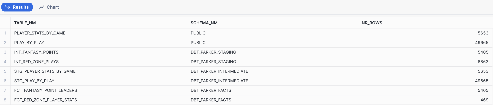
- An nfl_teams.csv loaded into the seeds folder to look up the full names for the three-letter abbreviations for the teams in the provided data

## ⚙️ Methodology
### Tools Used
- Paradime for dbt™ modeling and SQL
- Snowflake for data warehousing
- Lightdash for visualization (run locally in Docker image)

### Applied Techniques
Each of the dashboards is built on a different fact table as follows:
- **The Hard Yards** - fct_team_yards
- **Passers and Rushers** - fct_player_yards
- **Penalties** - fct_penalties

There appear to be a wide range of insights waiting to be dug out of the public play_by_play data but the table is wide 
at almost 400 columns and many of these hold a high number of null values. So various combinations of techniques had to
be used, among them:
- filtering
- flattening
- enriching
- derived calculations
- de-normalising

Each fact table presented different challenges and their DAGs are included here to give some idea of the extent of the
data modeling involved.

**fct_team_yards**
The play_by_play data is based on the possession or offense team, so it can refer to either of the two teams involved in the
game. This fact table then has to be at the grain of game and offense team and make clear for any one row whether the offense team
is the home team or the away team.
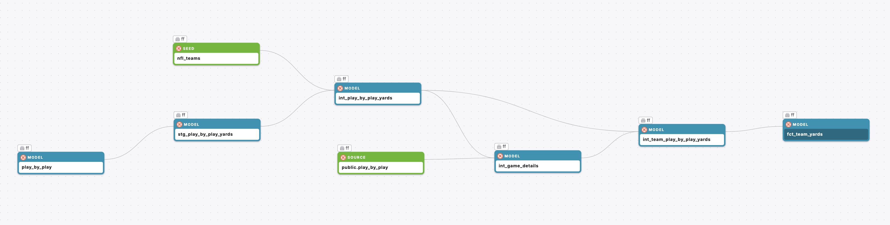

**fct_player_yards**
A similar challenge to fct_team_yards but at a different grain again as there can of course be many passers and rushers for one
team in a game.
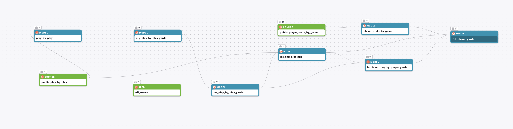

**fct_penalties**
A different challenge again because where a play is recorded with respect to the offense team, a penalty can be called on either
the offense or the defense team.

## 💡 Visualizations
For each dashboard, there are 3 screenshots - one of the entire dashboard and two close-ups, one each of the upper & lower sections 
where the commentary will be more easily read.

### The Hard Yards
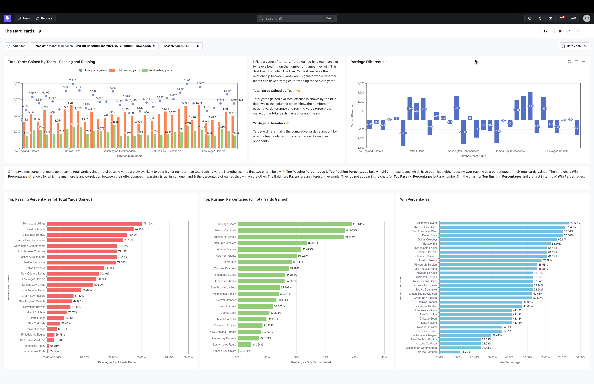

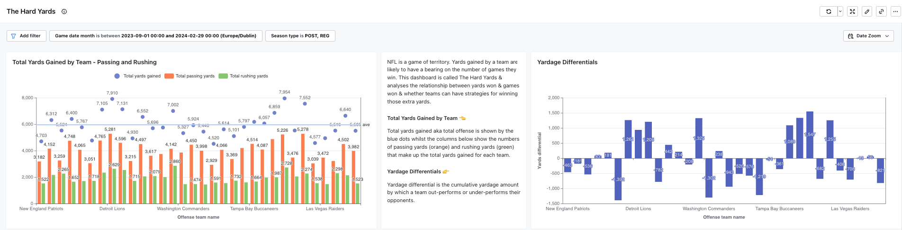

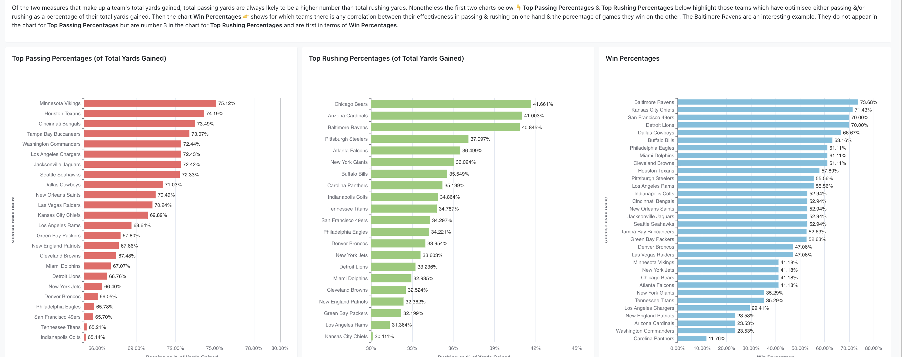

### Passers and Rushers
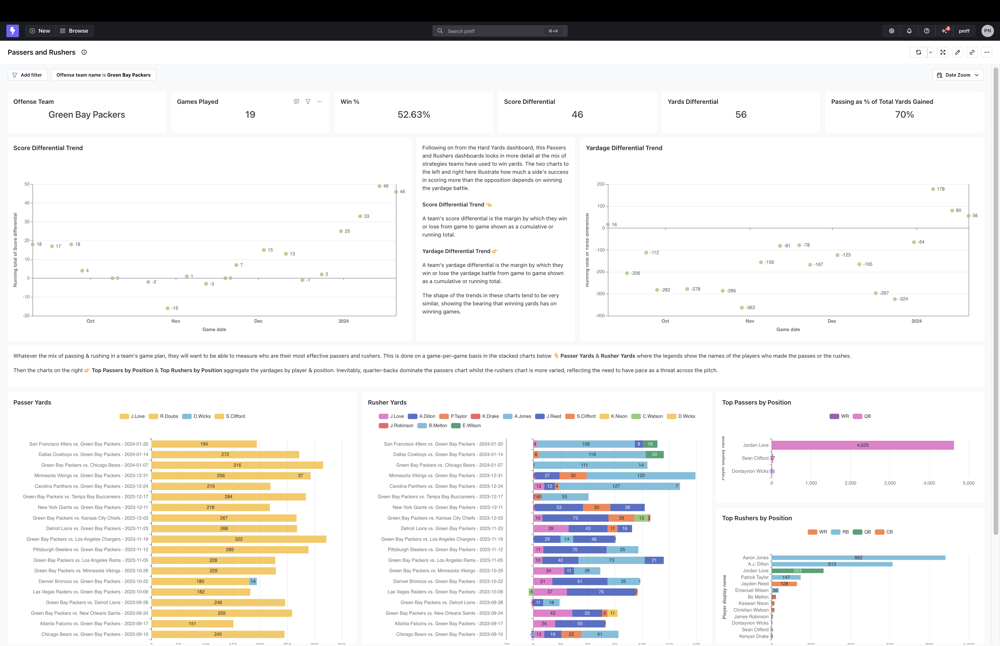

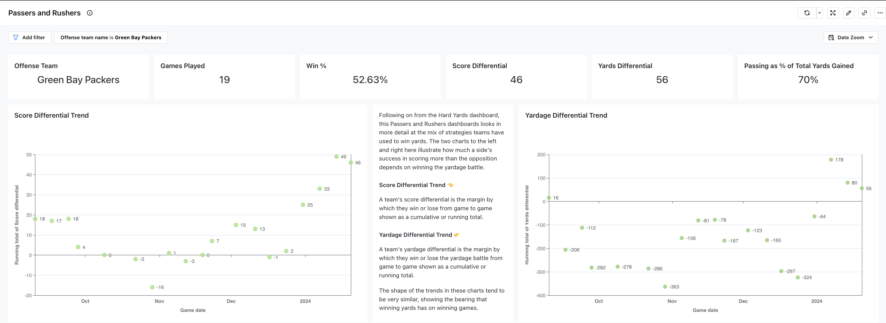

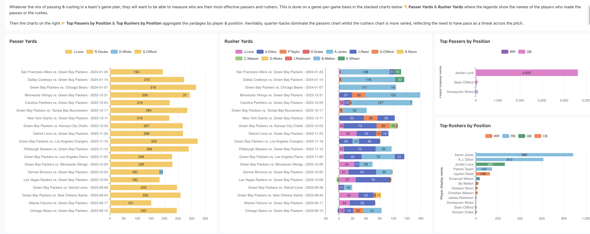

### Penalties
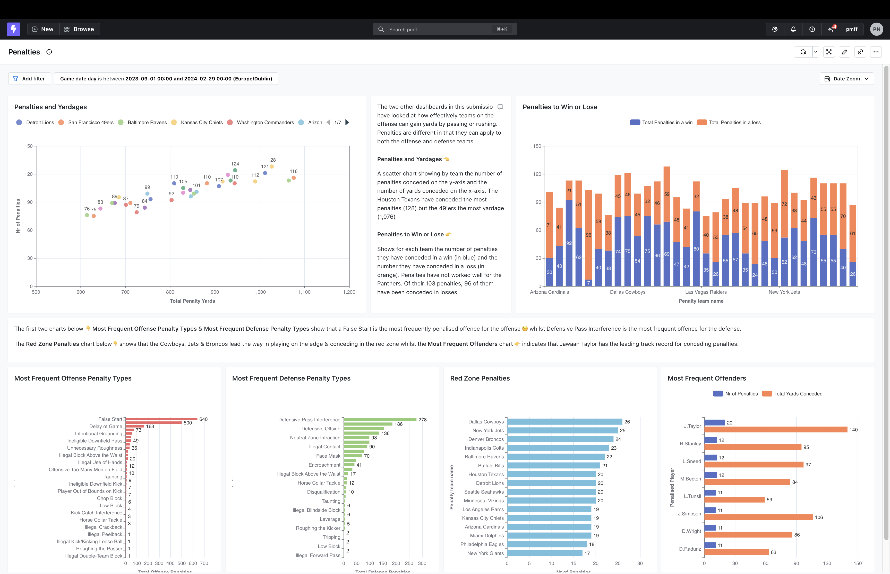

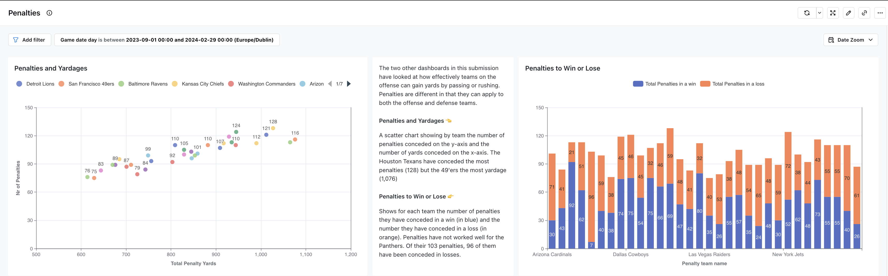

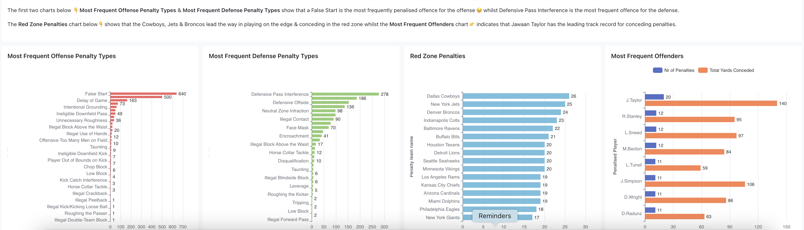

## 🔎 Insights
There are doubtless many more insights but the following are just some of the insights that the fact tables 
and the dashboards were able to deliver quickly:

**The Hard Yards**
- The Detroit Lions and the 49'ers gained the highest overall yardages at 7,910 & 7,954 respectively
- The New York Giants have the worst yardage differential
- The Baltimore Ravens have the highest win percentage despite not having one of the higher passing yards totals

**Passers and Rushers**
- The Ravens have been on an upward line all season for their score and yardage differentials
- The Green Bay Packers have twice managed to improve their results after a slump in form, helped by a total of 4,625 yards of successful passes by Jordan Love at Quarter-Back

**Penalties**
- The Houston Texans have conceded the most penalties at 128, whilst the Las Vegas Raiders have conceded the least at 75
- If the Carolina Panthers want to win more games, they have to concede less penalties
- Jawaan Taylor of the Kansas City Chiefs will be watched closely by referees

## Conclusions
Above are just a snapshot of the insights and recommendations that come from the few dashboards I have built. It is clear though that the
provided data sets offer a whole host more if the right techniques and logic can be applied.
