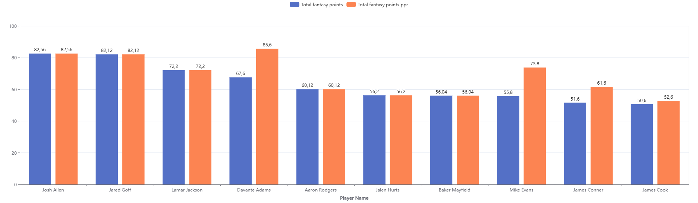
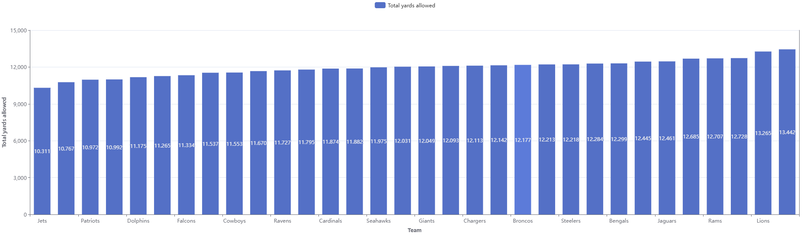
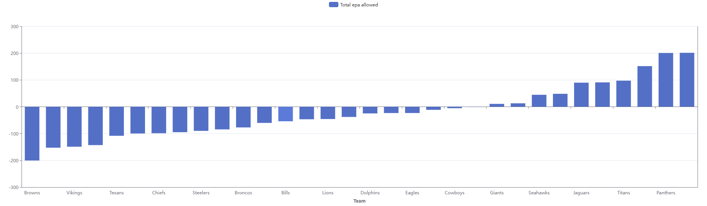
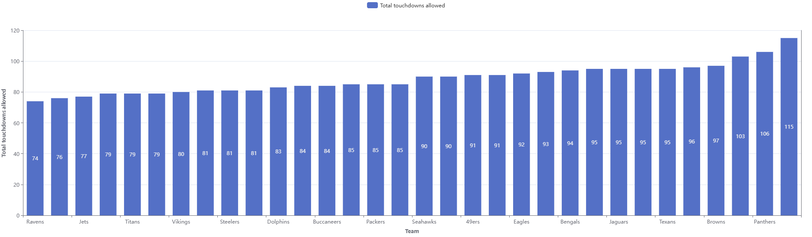
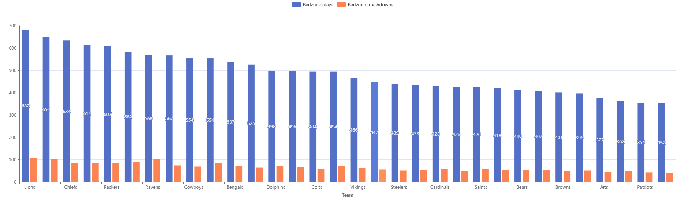
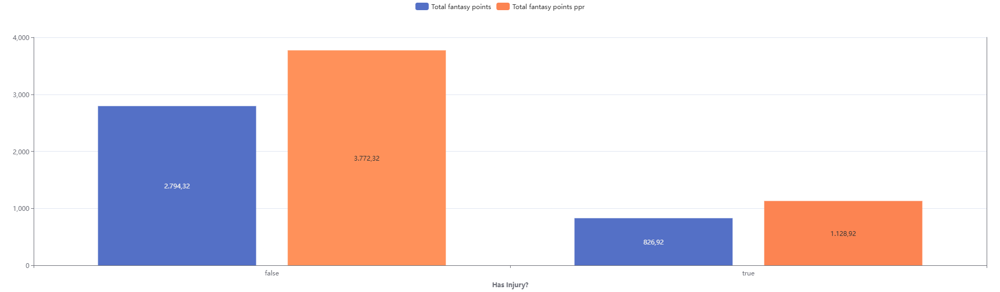
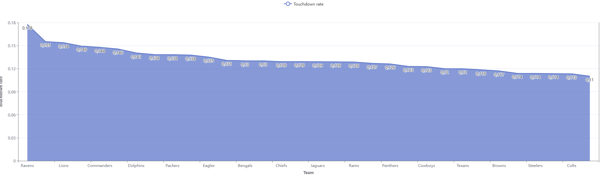
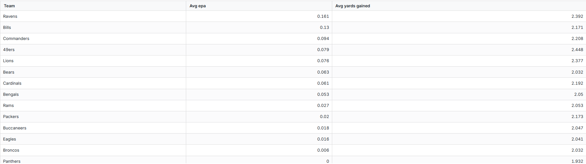

# Fantasy Football dbt Data Modeling Challenge - Fantasy Football Edition

Project for the dbt™ Data Modeling Challenge - Fantasy Football Edition, hosted by Paradime!

*by **[Arthur Rogério](https://www.linkedin.com/in/rogeriothur/)***  

---

## Table of Contents
1. [Introduction](#introduction)
2. [Data Sources](#data-sources)
3. [Methodology](#methodology)
4. [Visualizations](#visualizations)
5. [Insights](#insights)
6. [Conclusions](#conclusions)

---

## Introduction

This project transforms raw fantasy football data into actionable insights by leveraging robust data modeling with dbt™, data warehousing in Snowflake, and interactive dashboards built in Lightdash. Our aim is to uncover key trends in player performance, team defense, red zone efficiency, and the impact of injuries on NFL fantasy football outcomes.

**Dashboard Link:** [Lightdash Dashboard](https://app.lightdash.cloud/projects/f661a422-a5cb-46d9-9f0c-79b443b00694/dashboards/49af509c-c067-4a7d-94d3-07e05a64d881/view)  

---

## Data Sources
Data was gathered from the following sources:

- **NFL Fantasy Football Data (Snowflake):**
  - **player_stats_by_game:** Contains per-game statistics for players (e.g., passing, rushing, receiving, fantasy points).
  - **play_by_play:** Provides detailed play-by-play data including EPA (Expected Points Added), yards gained, and play types.
  - **nfl_injuries:** Reports detailing player injuries, statuses, and modifications (e.g., report status, practice status).
  - **nfl_teams:** Reference table containing key identifiers, names, and abbreviations for NFL teams.

---

## Data Lineage

### Staging Layer
- **Staging Layer:** Standardized raw data (e.g., renaming columns with suffixes like `_nr` for numbers and `_ts` for timestamps) and applied light transformations.
   - stg_nfl__injuries
   - stg_nfl__play_by_play
   - stg_nfl__player_stats_by_game
   - stg_nfl__teams

### Marts Layer
- **Marts Layer:** Built fact and dimension models:
  - **agg_player_performance:** Aggregates player statistics by week and season.
  - **agg_team_defense:** Aggregates defensive metrics (yards allowed, EPA allowed, touchdowns allowed).
  - **fact_redzone_efficiency:** Analyzes offensive efficiency in the red zone.
  - **fact_injury_impact:** Joins player performance with injury data to assess impact.
  - **dim_teams:** Reference table containing key identifiers, names, and abbreviations for NFL teams

### Exposures
To add the dashboard to the dbt`s lineage view, an exposure was created to represent it.
- `nfl_dash_results`

### Column Taxonomy Pattern

| Abbreviation of Nature | Description and recommended taxonomy | Data type |
|------------------------|--------------------------------------|-----------|
| dt                     | Date                                 | Date      |
| dm                     | DateTime                             | DateTime  |
| ts                     | Timestamp                            | Time      |
| tp                     | Type                                 | String    |
| desc                   | Description                          | String    |
| fl                     | Flag                                 | Bool      |
| id                     | Identifier                           | String    |
| nm                     | Name                                 | String    |
| nr                     | Number                               | Integer/Numeric|
| st                     | Status                               | String    |
| sk                     | Surrogate Key                        | Integer   |

## Methodology

### Tools Used
- **Paradime:** For dbt™ modeling and SQL development.
- **Snowflake:** Cloud data warehousing and computing.
- **Lightdash:** Building interactive, “scroll-stopper” dashboards.
- **dbt:** For data transformations, testing, and documentation.
- **Python:** For extracting/creating sources

### Applied Techniques

- **Data Extraction:**  
  Developed 4 Python scripts using the `nfl_data_py` library to extract NFL data. The scripts generate CSV files that contain the raw data.

- **Data Upload:**  
  Uploaded the generated CSV files directly to my Snowflake database via Snowsight, creating a dedicated schema named `raw_data` to store these datasets.

- **Staging Layer:**  
  In the staging layer, I performed data cleaning, type casting, and standardized the column naming conventions to ensure consistency and reliability across the datasets.

- **Marts Layer:**  
  Aggregated and transformed the cleaned data to build fact and dimension models. These models were designed to drive the dashboards, enabling the calculation of key metrics and providing actionable insights.

---

## Visualizations

Our dashboards provide multiple perspectives on NFL fantasy football data:

1. **Top Performers**
   - **Objective:** Display the top 10 players based on total fantasy points.
   - **Key Metrics:** `total_fantasy_points` (standard) and `total_fantasy_points_ppr` (Points Per Reception).
   - **Visualization:** Bar chart ranking players, with filters for season and week.

   

2. **Team Defense Impact**
   - **Objective:** Evaluate defensive performance.
   - **Key Metrics & Visualizations:**
     - **Defensive Yards Allowed by Team:** Bar chart exibiting `total_yards_allowed`.
     
     

     - **Defensive EPA Allowed:** Bar/column chart displaying `total_epa_allowed`.

     

     - **Defensive Touchdowns Allowed:** Bar chart com `total_touchdowns_allowed`.

     

3. **Red Zone Efficiency**
   - **Objective:** Measure offensive performance in high-pressure situations.
   - **Key Metrics:** `redzone_plays_nr`, `redzone_touchdowns_nr`, `avg_yards_gained`, `avg_epa`, e `touchdown_rate`.

   

4. **Injury Impact**
   - **Objective:** Comparar a performance dos jogadores com e sem lesões.
   - **Key Metrics:** `total_fantasy_points` e `total_fantasy_points_ppr` diferenciados por `injury_flag`.

   

## Insights

- **Top Performers:**  
  Players who consistently accumulate high total_fantasy_points stand out, but differences emerge when comparing the standard system with the PPR system. This indicates that players with many receptions may be valued differently in PPR leagues.
  - Players like Josh Allen, Jared Goff, and Davante Adams consistently rank among the top performers in both scoring formats.
  - PPR Rewards Receptions: Some Wide receivers gain a significant boost in PPR scoring, highlighting the impact of frequent receptions.
  - Standard vs. PPR Differences: Quarterbacks maintain high rankings in standard scoring, but reception-heavy players gain an edge in PPR, making player valuation highly dependent on league format.
  - Strategic Considerations: Fantasy team managers should assess player performance based on league settings, as PPR leagues favor receivers who accumulate catches, while standard scoring relies more on touchdowns and yardage.

- **Team Defense Impact:**  
  Defenses that restrict yards allowed and limit EPA tend to concede fewer touchdowns, demonstrating a clear relationship between defensive efficiency and reduced opponent points.

  - Defensive Yards Allowed by Team
    - Best defense: The Jets allowed the fewest yards, suggesting a well-structured defense, possibly with an efficient secondary and strong pressure on the opposing quarterback.
    - Worst Defense: The Commanders had the worst performance, giving up the most yards, which could indicate structural issues on the defensive line and secondary coverage.
    - For Fantasy Football: Teams that face defenses like the Commanders have a high chance of an explosive offensive performance, making opposing quarterbacks and wide receivers valuable picks.
    - For sports betting: Teams with weak defenses may have more high-scoring games, favoring bets on "over" total points.
  - Defensive EPA Allowed
    - The Browns lead with the most efficient defense, allowing the lowest EPA allowed. This suggests a well-tuned defensive scheme capable of stopping explosive plays and limiting scoring. The Ravens and Vikings also appear to have low EPA allowed values, indicating well-organized defenses.
    - The Commanders have the most vulnerable defense, allowing the most EPA to their opponents, suggesting that facing them could be an excellent offensive opportunity. Teams like the Lions and Bills also have high EPA allowed values, which indicates difficulties in containing efficient offensive plays.
    - For Fantasy Football: Attackers facing teams like the Commanders and Lions should be prioritized, as these defenses allow for many impactful plays.
    - For Season Assessment: Teams like the Browns and Ravens can be more consistent on defense, making it harder for opponents to advance offensively.
  - Defensive Touchdowns Allowed
    - The Ravens have the most efficient defense, allowing just 74 total TDs, indicating excellent red zone containment and a solid defense. The Saints and Jets also perform well, reinforcing that these defenses are strong at preventing scoring.
    - Commanders appear as the weakest defense, giving up the most touchdowns, suggesting structural problems and difficulties in defensive coverage. Other teams such as Lions and Bills also have high values, which could mean difficulties in containing opposing attacks.

- **Red Zone Efficiency:**  
  Teams with high red zone conversion rates (high `touchdown_rate`) demonstrate greater offensive efficiency, a critical indicator in decisive moments of games.
  - The Ravens lead the way with the best red zone conversion rate, indicating a well-structured offense that is effective in short-yardage situations. Other teams with high efficiency include the Eagles and Bills, which suggests that their red zone plays are well-executed, with offensive calls that maximize scoring opportunities.
  - The Raiders have the worst performance, suggesting they have trouble converting good drives into touchdowns. Teams like the Bears and Panthers also perform poorly, possibly indicating problems in the ground game, low QB effectiveness in the red zone, or predictable calls that make it difficult to execute TDs.
  - For Fantasy Football: Offensive players from teams like the Ravens and Eagles have a higher chance of scoring TDs inside the red zone, making RBs and TEs from these teams interesting options.
  - For Betting: Games involving the Raiders or Panthers may have fewer touchdowns and more field goal attempts, making under TD bets more valuable.
  - For Season Assessment: Teams with low efficiency in the red zone need to improve offensive execution, either through tactical schemes or reinforcements in the roster.

- **Injury Impact:**  
  Preliminary analysis suggests that players with reported injuries experience a significant reduction in point production, underscoring the importance of monitoring health status for roster decisions.
  - Players without injuries had an average of 2,794.32 points. Injured players dropped to 826.92 points. Average difference of 1,967.4 points, showing that injuries have a highly negative impact on overall performance.
  - Players without injuries averaged 3,772.32 points. Injured players dropped to 1,128.92 points. Average difference of 2,643.4 points, indicating that the impact of injuries is even more severe in the PPR format, where receptions make a significant difference. (PPR)
  - Injuries drastically reduce players' scoring in both formats. In PPR, the impact is even greater, possibly because players who rely on receptions (WRs and TEs) are more vulnerable to injuries and drops in playing volume.
  - The average drop of over 2,000 fantasy points suggests that in most cases, injured players fail to make a significant impact even when they return. This suggests that fielding players returning from injury can be a big risk, especially if they are not fully recovered.
  - In fantasy leagues, teams should monitor injury reports and avoid players who are recovering from serious injuries. Depending on the type of injury (muscle, concussion, knee), players may lose explosiveness, playing volume, and even essential snaps.
  - For Fantasy Football: Avoid players who are listed as questionable and not guaranteed to play in the game. If a player is returning from injury, it is important to analyze how his playing volume is being adjusted. For Betting: Games where a team loses a key player to injury can have a significant impact on the point line, as offensive production drops considerably.

- **Touchdown Rate**
  - The Ravens have the highest touchdown rate, standing out as one of the most lethal offenses. The Bills, Lions and 49ers are also among the best, suggesting well-organized and effective offenses.
  - The Raiders have the lowest touchdown rate, suggesting offensive struggles and a lack of conversion of possessions into points. Other teams like the Panthers and Bears also perform poorly, indicating possible issues with predictable offensive calls or execution failures.
  - Most teams have an efficiency between 12% and 14%, but there are some with much higher performance (above 17%) and others significantly lower.
  - For Fantasy Football: Offensive players from teams like the Ravens and Bills are more valuable because their offenses are more likely to finish drives with touchdowns.
  - For Betting: Teams with a low touchdown rate may indicate games with fewer points, favoring bets on the under total points.

  

- **Table Yards Gained vs EPA**
  - Average EPA per play: -0.0204, indicating that most teams have a slightly negative impact on expected score per play.
  - Average yards gained per play: 2.02 yards, a relatively low value, which suggests that many plays are short or without great impact.
  - The Ravens lead as the most efficient team with a positive EPA, meaning their plays not only gain yards but also significantly increase expected scoring. Other efficient teams include the Bills and 49ers, indicating that their offensive calls are well-tuned to maximize impact on the scoreboard.
  - The Giants have the worst average EPA, suggesting that their plays, even when they gain yards, do not have a real impact on the scoreboard. This could indicate problems with play-calling, execution, or a lack of offensive talent. Other teams like the Panthers and Bears also have negative EPA, reinforcing that gaining yards does not always translate into offensive success.
  - Gaining a lot of yards doesn't always mean being efficient. Some teams gain a lot of yards without significantly increasing their scoring expectation.
  - There are teams that, despite having a negative EPA, still accumulate good average yards. This may indicate that these teams rely heavily on long plays, but fail to convert those plays into points.
  - For Fantasy Football: Players on teams like the Ravens and Bills can be more valuable as their plays not only gain yards but also result in more touchdowns.
  - For Betting: Teams with low EPA, such as the Giants and Panthers, tend to struggle to convert drives into points, making games with these teams less likely to be high-scoring.
  - For Season Evaluation: Teams that gain a lot of yards but have a negative EPA need to review their play-calling in the red zone and efficiency on third downs.

  

---

## Conclusions

This project demonstrates the power of a robust, data-driven approach to unraveling complex trends in NFL fantasy football. By integrating multiple data sources—from detailed player and play-by-play statistics to injury reports—and processing them through a well-defined dbt pipeline, we have achieved the following:

- **Comprehensive Data Modeling:**  
  Leveraging Python scripts with `nfl_data_py` for extraction, a systematic upload via Snowsight into a dedicated `raw_data` schema, and rigorous transformations in both the staging and marts layers, we standardized and enriched raw data into actionable models. These models not only ensure data quality through extensive testing but also enable clear aggregation of key metrics.

- **Actionable Insights:**  
  - **Player Performance Variability:** Our analysis confirms that player rankings vary considerably between standard scoring and PPR systems, highlighting the necessity of aligning evaluations with league formats.
  - **Defensive Efficiency:** The aggregation of defensive metrics (yards allowed, EPA allowed, and touchdowns conceded) reveals that strong defensive units directly impact offensive production, offering strategic cues for both fantasy managers and sports bettors.
  - **Red Zone Conversion:** High red zone efficiency emerges as a critical driver of offensive success, emphasizing that effective play-calling and execution in short-yardage situations can markedly influence overall performance.
  - **Injury Impact:** The pronounced decline in fantasy points for players with injury reports reinforces the need for vigilant roster management and underscores the risk of relying on players returning from injury.

- **Enhanced Decision-Making:**  
  The interactive dashboards built in Lightdash translate these complex data transformations into clear, visual narratives. They empower stakeholders to quickly identify trends, assess matchup implications, and refine strategic decisions based on real-time performance metrics.

---

## Next Steps

Building on the solid foundation established by this project, future enhancements could further elevate the depth and utility of our analysis:

- **Integration of Additional Data Sources:**  
  - **Real-Time Data Feeds:** Incorporate live data sources (e.g., weather conditions, real-time injury updates, and play-by-play feeds) to refine insights during game days.
  - **Expanded External Metrics:** Include complementary datasets such as advanced analytics (e.g., player tracking data) or betting odds to provide a broader context for performance evaluation.

- **Advanced Analytics & Predictive Modeling:**  
  - **Machine Learning:** Develop predictive models to forecast player performance and injury recovery trajectories, aiding in more informed roster decisions.
  - **Scenario Analysis:** Implement "what-if" simulations (e.g., impact of a key injury on team performance) to explore potential outcomes and strategic adjustments.

- **Dashboard Enhancements:**  
  - **User Customization:** Allow end-users to create personalized dashboards with custom filters and metrics, enhancing interactivity and user engagement.
  - **Granular Temporal Analysis:** Refine the temporal granularity in dashboards (e.g., intra-game analysis) to capture dynamic shifts in performance throughout a match.

- **Continuous Feedback and Iteration:**  
  - Solicit feedback from fantasy football managers, sports analysts, and bettors to identify new key metrics and improve dashboard usability.
  - Regularly update models and visualizations as new data becomes available to ensure the analysis remains current and actionable.

In conclusion, this project not only meets the challenge criteria by delivering high-quality data models, rigorous testing, and compelling visualizations but also lays the groundwork for future innovation in fantasy football analytics. The insights derived here are poised to offer a competitive edge in decision-making and strategic planning for fantasy football stakeholders.

Thank you for exploring this analysis. Your feedback and collaboration will be invaluable as we continue to evolve this project.
