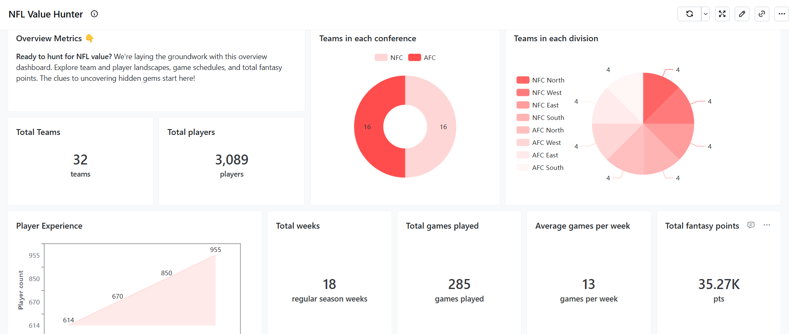
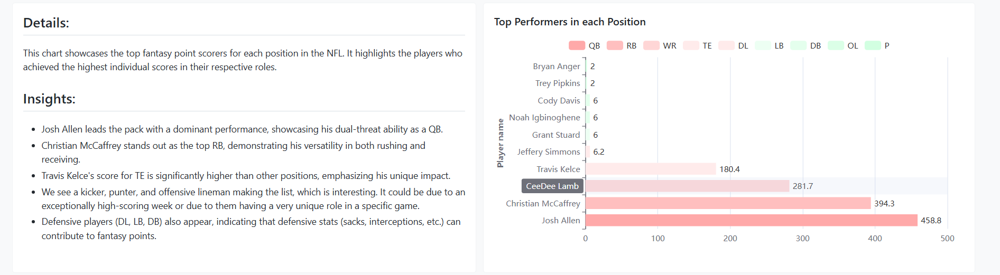
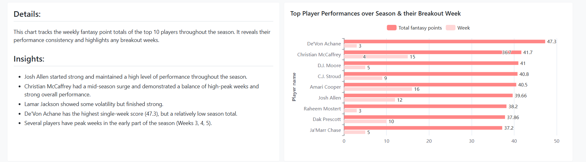
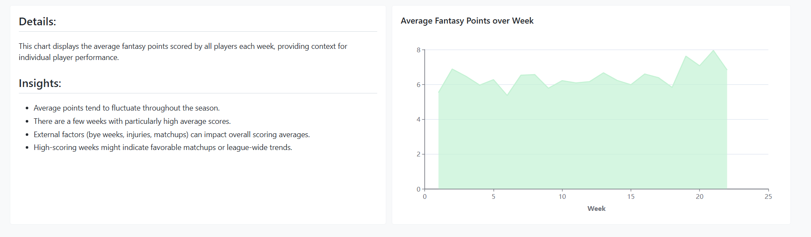
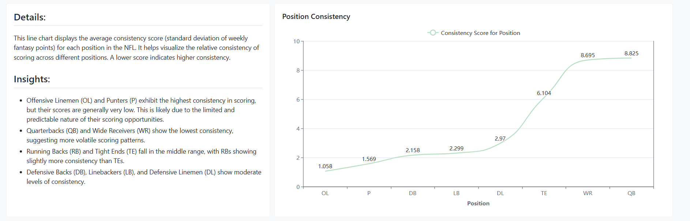
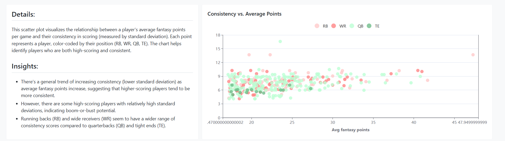

# 🏈 NFL Fantasy Football Edition - dbt™ Data Modeling Challenge

Project for the dbt™ Data Modeling Challenge - Fantasy Football Edition, Hosted by Paradime!

*by **👊 [Ramyashree Shetty](https://www.linkedin.com/in/ramyashree-shetty/)***

## Table of Contents

1. [Introduction](#introduction)
2. [Data Sources](#data-sources)
3. [Methodology](#methodology)
4. [Data Lineage](#data-lineage)
5. [Visualizations](#visualizations)
6. [Insights](#insights)
7. [Conclusions](#conclusions)

## Introduction

Welcome, fellow Value Hunters! This dashboard is your treasure map to uncovering hidden gems in the world of fantasy football. We're not just chasing points; we're hunting *value* – those players who outperform their perceived worth, giving you the edge you need to dominate your league.  Think of it as Moneyball for fantasy football, but with cooler charts. 

## Data Sources 

*   [nfl_data_py](https://github.com/nflverse/nfl_data_py): Library for interacting with NFL data and includes data for play-by-play data, weekly data, seasonal data, rosters, win totals, scoring lines, officials, draft picks.

*   [2023 NFL Salary](https://www.spotrac.com/nfl/rankings/player/_/year/2023/sort/cap_base): Scraped from spotrac for player's salary for season 2023.

## Methodology

### Tools Used:

*   Paradime for dbt™ modeling and SQL development – Where the magic happens.
*   Snowflake for data warehousing –  Our data fortress.
*   Lightdash for data visualization – Turning numbers into narratives.

### Applied Techniques:

We used dbt to wrangle the data into shape, employing:

*   **Dimensional Modeling:** Creating star schemas for efficient analysis – because nobody likes slow queries.
*   **Data Aggregation:** Calculating key metrics like total points, consistency, red zone efficiency, and ROI.
*   **Data Quality Tests:** Ensuring our data is clean and reliable – garbage in, garbage out, as they say.
*   **Metric Calculation:**  Building our "value hunter" toolbox with custom metrics.

## Data Lineage

## Visualizations 

*   **Overall Metrics of the Season**   
  

*   **Top Performers Over Season:**  
Who consistently brought the heat?  
 
 
 
  

*   **Consistent Performers:** 
Finding the reliable scorers   
 
 
  

*   **Red Zone Efficiency for Most Touchdowns:**  
 Who's cashing in on scoring opportunities?   
   

*   **Highest ROI Players:**  
The value hunters' dream chart.   
  
   

*   **Injury Propensity:**  
Are injuries affecting teams/players?   
   

## Insights 

*   **Consistency is King (or Queen):**  High points are great, but *consistent* high points are gold.
*   **ROI is the Ultimate Value Metric:**  It's not just about points; it's about points *per dollar*.
*   **Injuries Can Make or Break a Season:**  Staying on top of injury trends is crucial.
*   **Knees and Ankles Take a Beating:**  Protect those joints!

## Conclusions 

This dashboard empowers you to become a true "Value Hunter" in your fantasy league.  By combining data-driven insights with a bit of savvy, you can build a winning team without breaking the bank (or your salary cap).  Remember, it's not just about chasing stars; it's about finding the players who shine brightest for their cost!