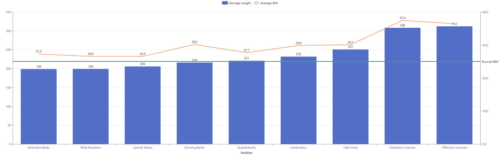
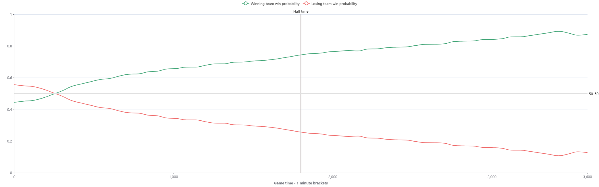
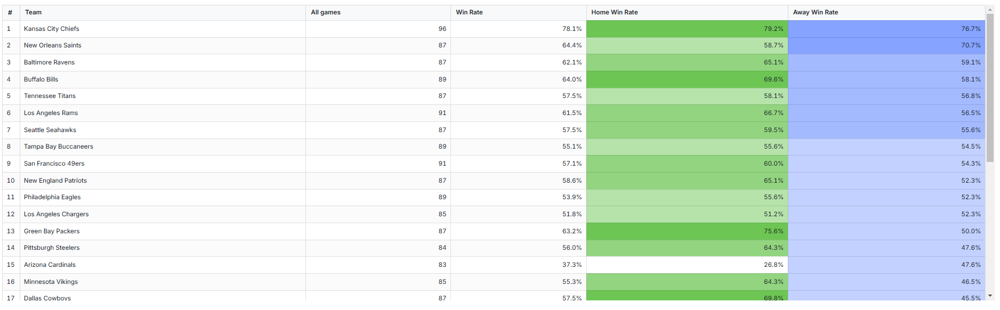
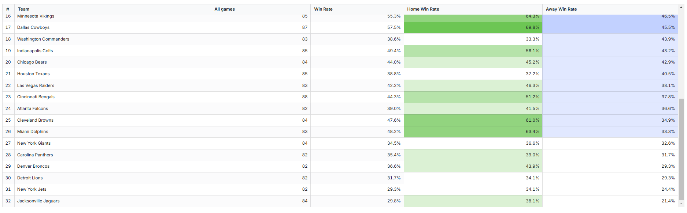
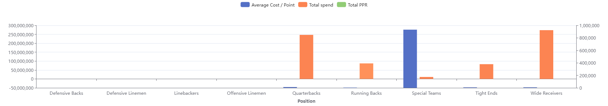

# dbt™ Data Modeling Challenge - Fantasy Football Edition

## Table of Contents
1. [Introduction](#introduction)
2. [Data Sources](#data-sources)
3. [Methodology](#methodology)
4. [Visualizations](#visualizations)
5. [Insights](#insights)
6. [Conclusions](#conclusions)

## Introduction
In this challenge, my goal was to explore NFL data and generate meaningful insights that can help fantasy football players and analysts. 
The analysis leverages historical data from the 2018-2023 seasons to identify patterns, trends, and anomalies in player and team performance. 
This report highlights key findings and showcases the power of data modeling and visualization in understanding the game.

## Data Sources
- NFL player_stats data Seasons 2018-2023
- NFL play_by_play data Seasons 2018-2023
- [Additional Data Set 2] - [Description]

## Methodology
### Tools Used
- Paradime for dbt™ modeling and SQL
- Snowflake for data warehousing
- Lightdash for visualization
- Python for pulling additional NFL data

### Applied Techniques
In this project I involved multiple data transformation processes, including:

Data extraction and loading from various sources

Cleaning and normalizing play-by-play data

Calculating new metrics, such as win rates, player phisyque statistics and fantasy points

Aggregating player performance metrics by game and season

Team-level data modeling to assess spending, performance

Creating visualizations in Lightdash to support data-driven insights

## Visualizations
1. Weight and BMI Distribution by Position

This chart visualizes the average weight and BMI for each position in the NFL. 
Interestingly, while the average BMI exceeds the normal range across all positions, this reflects the specific physical requirements of the sport 
rather than unhealthiness. 
Positions like offensive and defensive linemen show the highest BMI due to their need for size and strength, 
while wide receivers and defensive backs tend to have a lower BMI due to their speed and agility requirements.

2. Win Probability Progression

This visualization explores how win probability evolves during a game, using one-minute time brackets across multiple games. 
A key observation is that by halftime, many matches are already leaning heavily toward one side, with the winning team often maintaining a 75% or higher win probability. 
This indicates that momentum plays a significant role in determining outcomes early in the game.

3. Team Win Rates

This table presents the win rates for all NFL teams, broken down by overall win rates, home win rates, and away win rates. 
It’s clear that some teams perform significantly better on their home turf, indicating the importance of crowd support and familiarity with the playing environment. 
Conversely, teams with strong away records, such as Kansas City, demonstrate resilience and adaptability.

4. Total Cap and Fantasy Points relationship

Due to limited available data and time constraints, the dataset was not fully cleaned and it had not been ready for analysis yet.
## Insights
1. Physical Metrics and Performance:

Positions requiring strength and blocking, such as offensive and defensive linemen, have the highest average BMI and weight.

Speed positions like wide receivers and defensive backs maintain a relatively lower BMI to balance speed and agility with physical durability.

2. Momentum and Game Outcomes:

Win probability trends suggest that once momentum shifts in favor of a team, it’s difficult to reverse.

By halftime, many games are already decided in terms of win probability exceeding 75%.

3. Team Win Rates:

Teams like the Kansas City Chiefs and Baltimore Ravens have consistently high win rates both at home and away.

Some teams struggle significantly on the road, underscoring the impact of home advantage.

There’s a wide variation in performance consistency, with certain teams excelling across all conditions.

## Conclusions
This analysis highlights key trends in NFL performance and player attributes. 
BMI distribution confirms that while player weights vary by position, all are well above "normal" BMI ranges, reflecting specialized athletic builds. 
Win probability trends show that most games are effectively decided by halftime, with the leading team having a strong advantage. 
Win rate analysis reveals significant differences in home and away performance, emphasizing the impact of home-field advantage and other external factors. 
These findings provide a clearer picture of team dynamics and player roles in the NFL.