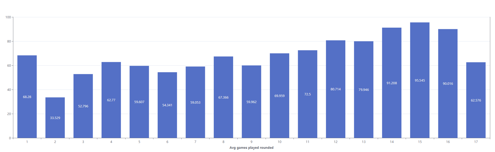

# Fantasy Football Insights – Paradime Data Modeling Challenge

## Table of Contents
- [Introduction](#introduction)
- [Data Sources](#data-sources)
- [Methodology](#methodology)
  - [Tools Used](#tools-used)
  - [Data Preparation & Modeling](#data-preparation--modeling)
  - [Model Lineage](#model-lineage)
- [Visuals & Key Metrics](#visuals--key-metrics)
  - [General Analysis](#general-analysis)
  - [Contracts & Fantasy Performance](#contracts--fantasy-performance)
  - [Availability & Fantasy Performance](#availability--fantasy-performance)
- [Insights & Findings](#insights--findings)
- [Final Thoughts](#final-thoughts)

---

## Introduction
For this edition of Paradime's data modeling challenge, I set out to uncover insights for fantasy football players using NFL-related datasets. My main goal was to analyze two key factors that impact fantasy performance:  
1. **Player Contracts** – How does a player's contract status (rookie year, final year, mid-contract) relate to their fantasy performance?  
2. **Player Availability** – Does past availability (games played) predict future fantasy output?  

To explore these questions, I combined player performance data with contract history, using dbt™, Snowflake, and visualization tools.

---

## Data Sources
I used two primary datasets:  

- **NFL_PLAYERS_STATS_2015_2025** – A game-level dataset of NFL player statistics from the past 10 years, pulled using the `nfl_data_py` API (script provided by Paradime).  
- **NFL_CONTRACTS** – A dataset containing 20+ years of player contract history. I scraped this data from [OverTheCap](https://overthecap.com/contract-history) using a custom Python script ([script link]).

---

## Methodology

### Tools Used
- **Paradime** – dbt™ modeling and SQL  
- **Snowflake** – Data warehousing  
- **Lightdash** – Data visualization  
- **Python** – Data extraction (from `nfl_data_py` and OverTheCap scraping)  

### Data Preparation & Modeling

1. Extracted 10 years of player data to ensure enough overlap between player contracts and performance.  
   - Longer contracts (4-6 years) mean some players might not have multiple contract periods within a shorter window.  
   - I avoided older data to minimize the impact of changes in the game’s style and rules.  

2. Built two **staging models**:  
   - `stg_contracts` – Cleaned and structured contract data.  
   - `stg_player_stats_by_game` – Organized player performance on a per-game basis.  

3. Created an **intermediate model** (`int_fantasy_points`) to:  
   - Aggregate performance data at the **season level**.  
   - Select the **top 100** players from each season based on:
     - **Total PPR points** (important for season-long leagues).  
     - **Average PPR points per game** (to account for injuries and missed games).  
   - While standard fantasy leagues typically have 150-240 rostered players, the **top 100** represents the **core fantasy-relevant players**—those who are consistently starters and have the most impact on season outcomes.  

   This approach ensures we don’t exclude high-performing but injury-prone players solely due to missed games.  

4. Built **fact models** to analyze different aspects:  
   - `fct_contract_year` – Identifies players' **first and last contract years** within the 10-year period.  
   - `fct_player_availability` – Focuses on how **games played** affects fantasy performance.  

### Model Lineage
[Insert lineage diagram here]

---

## Visuals & Key Metrics

### General Analysis
1. **Number of players by position**  
2. **PPR distribution per position**  

### Contracts & Fantasy Performance
3. **Fantasy PPR by first contract year**  
4. **Fantasy PPR by final contract year**  
5. **Comparing first-year vs. final-year performance**  
6. **Mid-contract performance breakdown** (by contract year & position)  
7. **1-year deals & PPR trends** (lowest average PPR?)  

### Availability & Fantasy Performance
8. **PPR vs. Average Games Played**  

9. **Availability breakdown by position**  

---

## Insights & Findings
- **Do players perform better in contract years?**  
- **Do rookies outperform veterans on a per-game basis?**  
- **Does missing games predict future unavailability?**  

---

## Final Thoughts
This analysis helps fantasy football managers identify undervalued players by considering both **contract status** and **availability trends**. By modeling these factors, we can make data-driven draft decisions and reduce risk when selecting players.  

---

Feel free to customize further if you want to expand on the insights section or add specific visualizations! 🚀
