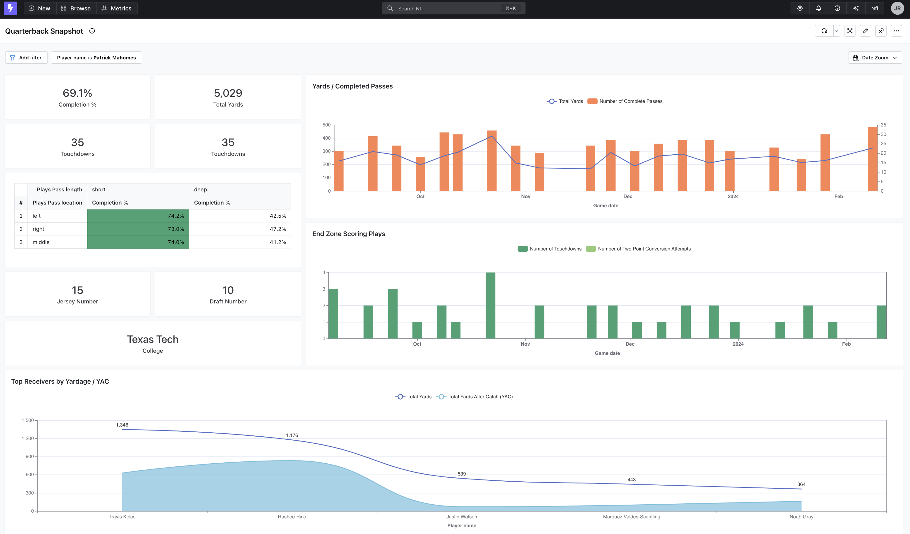
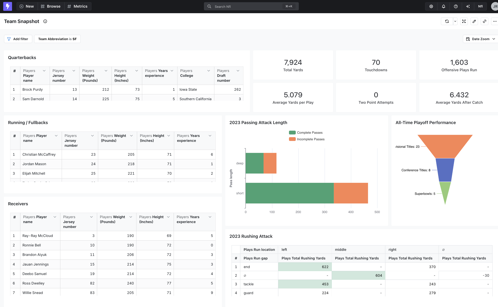
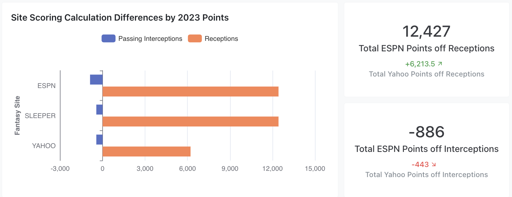
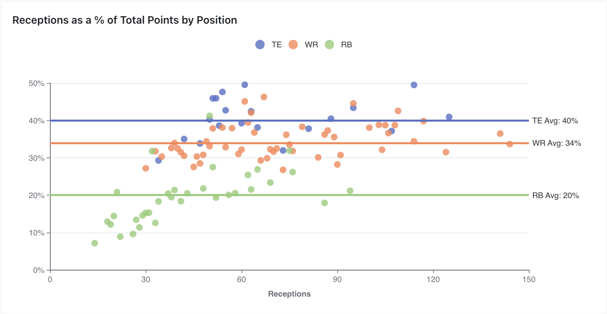

# Lightdash / Paradime Fantasy Football  Contest

### Entrant: John Ramsey

## Project Overview

For my entry, I leveraged Lightdash’s self-service analytics capabilities to empower a broad audience with data. Rather than just creating a traditional dashboard, my primary goal was to develop the most effective self-service data mart for the 2023 NFL season. Additionally, I sought to answer a long-standing question: which player's performance fluctuates depending on the fantasy platforms? This analysis takes a more structured approach to understanding those differences.

## Part 1 - Building the Best Self-Service Data Mart for the 2023 NFL Season

- Structured common objects (teams, players, games, plays, etc.) in a logical and intuitive manner.
- Enabled end users to explore the data with ease, ensuring that common joins (e.g., Players -> Teams) were straightforward.
- **Ensured consistent data granularity**: Each view maintains a single level of granularity (e.g., clicking on 'plays' only returns play-level data), preventing user confusion over perceived "duplicate" rows.
- Incorporated **user-friendly hyperlinks** for all common sites and identifiers, allowing users to click through data to relevant sites.
- Developed **out-of-the-box dashboards** for exploring  data on a specific team / quarterback, something that a less technical user could start with.
- Set **team colors** in the mart’s `.yml` file for easy plotting, eliminating the need to manually search for color hex codes.
- Implemented **~50 tests** to ensure a high quality of data for future NFL seasons. Examples include correct team names, limited jersey numbers (0-99), and primary key validations. 

---

## Part 2 - Fantasy Site Scoring Rule Difference Comparison

###  Objectives

- Analyze how major fantasy football platforms (ESPN, Yahoo, Sleeper) differ in their scoring rules.
- Identify which players perform better or worse across platforms due to scoring calculation variations.

### Stock Scoring System Differences

As of 2023, the primary differences between platforms were:

- **Points per reception (PPR)**: Yahoo awards **0.5 points** per reception, while ESPN and Sleeper use **1 point** per reception.
- **Interceptions thrown**: ESPN penalizes quarterbacks **-2 points** per interception, **double** the penalty used by Yahoo and Sleeper.
- Other major scoring categories (touchdowns, yards, fumbles) are **identical** across platforms.

### Impact of Scoring Differences

#### Total Point Impact: Receptions vs. Interceptions

- **In 2023, total points gained from receptions far outweighed points lost from interceptions.**
	- **Sam Howell** is the first QB whose rankings differ across sites, **14th in ESPN but 13th in Sleeper and Yahoo**.
- Players who rely heavily on receptions are most impacted by Yahoo’s scoring system.
  - **Running backs** (\~20% of points from receptions) are least affected.
  - **Wide receivers** (\~34% of points from receptions) feel a moderate impact.
  - **Tight ends** (\~40% of points from receptions) are most affected.

Receivers who catch many short passes are disproportionately penalized by Yahoo’s scoring. Further analysis could explore if these players are involved in **designed short-yardage plays**, or if they mostly **check-down targets**.

---

## Numerically Impacted Players & Theories

Below are profiles of the top five impacted players and the reasoning behind their rankings. Players such as Engram and Kincaid were solid fantasy pickups despite the impact.

### Tyler Conklin

- **Yahoo Scoring Outlook**: A mid TE2 in ESPN leagues, Conklin scored **24.8% fewer points** in Yahoo leagues, dropping below Hunter Henry and Isaiah Likely.
- **Takeaway**: Players on **high-pressure teams (e.g., Jets, 45% pressure rate)** may see their reception-based players struggle more.

### Evan Engram

- **Yahoo Scoring Outlook**: While Engram ranks behind only **Kelce and LaPorta** in ESPN leagues, he drops in Yahoo’s rankings due to **short-yardage receptions**.
- **Takeaway**: **Designed screens**, rather than QB check-downs, account for his high reception count, making him an interesting case.

### Chigoziem Okonkwo

- **Yahoo Scoring Outlook**: **Low red-zone involvement** and **only one touchdown from Derrick Henry** limit Okonkwo’s fantasy impact.

### Dalton Kincaid

- **Yahoo Scoring Outlook**: **23% fewer points** in Yahoo leagues, causing Kincaid to fall just below **Dalton Schultz (HOU)** in Yahoo rankings.
- **Takeaway**: Despite the scoring discrepancies, Kincaid remains a **low-end TE1** across platforms.