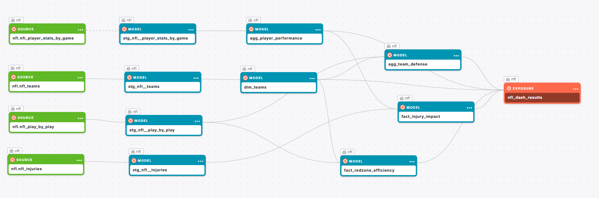

# Fantasy Football dbt Data Modeling Challenge - Fantasy Football Edition

Project for the dbt™ Data Modeling Challenge - Fantasy Football Edition, hosted by Paradime!

*by **[Arthur Rogério](https://www.linkedin.com/in/rogeriothur/)***  

---

## Table of Contents
1. [Introduction](#introduction)
2. [Data Sources](#data-sources)
3. [Methodology](#methodology)
4. [Visualizations](#visualizations)
5. [Insights](#insights)
6. [Conclusions](#conclusions)

---

## Introduction

This project transforms raw fantasy football data into actionable insights by leveraging robust data modeling with dbt™, data warehousing in Snowflake, and interactive dashboards built in Lightdash. Our aim is to uncover key trends in player performance, team defense, red zone efficiency, and the impact of injuries on NFL fantasy football outcomes.

**Dashboard Link:** [Lightdash Dashboard](https://app.lightdash.cloud/projects/f661a422-a5cb-46d9-9f0c-79b443b00694/dashboards/49af509c-c067-4a7d-94d3-07e05a64d881/view)  

---

## Data Sources
Data was gathered from the following sources:

- **NFL Fantasy Football Data (Snowflake):**
  - **player_stats_by_game:** Contains per-game statistics for players (e.g., passing, rushing, receiving, fantasy points).
  - **play_by_play:** Provides detailed play-by-play data including EPA (Expected Points Added), yards gained, and play types.
  - **nfl_injuries:** Reports detailing player injuries, statuses, and modifications (e.g., report status, practice status).
  - **nfl_teams:** Reference table containing key identifiers, names, and abbreviations for NFL teams.

---

## Data Lineage

### Staging Layer
- **Staging Layer:** Standardized raw data (e.g., renaming columns with suffixes like `_nr` for numbers and `_ts` for timestamps) and applied light transformations.
   - stg_nfl__injuries
   - stg_nfl__play_by_play
   - stg_nfl__player_stats_by_game
   - stg_nfl__teams

### Marts Layer
- **Marts Layer:** Built fact and dimension models:
  - **agg_player_performance:** Aggregates player statistics by week and season.
  - **agg_team_defense:** Aggregates defensive metrics (yards allowed, EPA allowed, touchdowns allowed).
  - **fact_redzone_efficiency:** Analyzes offensive efficiency in the red zone.
  - **fact_injury_impact:** Joins player performance with injury data to assess impact.
  - **dim_teams:** Reference table containing key identifiers, names, and abbreviations for NFL teams

### Exposures
To add the dashboard to the dbt`s lineage view, an exposure was created to represent it.
- `nfl_dash_results`

### Column Taxonomy Pattern

| Abbreviation of Nature | Description and recommended taxonomy | Data type |
|------------------------|--------------------------------------|-----------|
| dt                     | Data                                 | Date      |
| dm                     | DataHora                             | DateTime  |
| ts                     | Timestamp                            | Time      |
| tp                     | Tipo                                 | String    |
| desc                   | Descrição                            | String    |
| fl                     | Flag                                 | Bool      |
| id                     | Identificador                        | String    |
| nm                     | Nome                                 | String    |
| nr                     | Número                               | Integer/Numérico|
| st                     | Status                               | String    |
| sk                     | Chave Surrogada                      | Integer   |

## Methodology

### Tools Used
- **Paradime:** For dbt™ modeling and SQL development.
- **Snowflake:** Cloud data warehousing and computing.
- **Lightdash:** Building interactive, “scroll-stopper” dashboards.
- **dbt:** For data transformations, testing, and documentation.
- **Python:** For extracting/creating sources

### Applied Techniques

- **Data Extraction:**  
  Developed 4 Python scripts using the `nfl_data_py` library to extract NFL data. The scripts generate CSV files that contain the raw data.

- **Data Upload:**  
  Uploaded the generated CSV files directly to my Snowflake database via Snowsight, creating a dedicated schema named `raw_data` to store these datasets.

- **Staging Layer:**  
  In the staging layer, I performed data cleaning, type casting, and standardized the column naming conventions to ensure consistency and reliability across the datasets.

- **Marts Layer:**  
  Aggregated and transformed the cleaned data to build fact and dimension models. These models were designed to drive the dashboards, enabling the calculation of key metrics and providing actionable insights.

---

## Visualizations

Our dashboards provide multiple perspectives on NFL fantasy football data:

1. **Top Performers**
   - **Objective:** Display the top 10 players based on total fantasy points.
   - **Key Metrics:** `total_fantasy_points` (standard) and `total_fantasy_points_ppr` (Points Per Reception).
   - **Visualization:** Bar chart ranking players, with filters for season and week.

2. **Team Defense Impact**
   - **Objective:** Evaluate defensive performance.
   - **Key Metrics & Visualizations:**
     - **Defensive Yards Allowed by Team:** Bar chart exibiting `total_yards_allowed`.
     - **Defensive EPA Allowed:** Bar/column chart displaying `total_epa_allowed`.
     - **Defensive Touchdowns Allowed:** Bar chart com `total_touchdowns_allowed`.

3. **Red Zone Efficiency**
   - **Objective:** Measure offensive performance in high-pressure situations.
   - **Key Metrics:** `redzone_plays_nr`, `redzone_touchdowns_nr`, `avg_yards_gained`, `avg_epa`, e `touchdown_rate`.

4. **Injury Impact**
   - **Objective:** Comparar a performance dos jogadores com e sem lesões.
   - **Key Metrics:** `total_fantasy_points` e `total_fantasy_points_ppr` diferenciados por `injury_flag`.

*Incluir capturas de tela ou links diretos para os dashboards interativos no Lightdash conforme a disponibilidade.*

---

## Insights

*(Esta seção será atualizada à medida que os dados das visualizações forem analisados. Seguem alguns insights preliminares baseados nas análises realizadas:)*

- **Top Performers:**  
  Players who consistently accumulate high total_fantasy_points stand out, but differences emerge when comparing the standard system with the PPR system. This indicates that players with many receptions may be valued differently in PPR leagues.
  - Players like Josh Allen, Jared Goff, and Davante Adams consistently rank among the top performers in both scoring formats.
  - PPR Rewards Receptions: Some Wide receivers gain a significant boost in PPR scoring, highlighting the impact of frequent receptions.
  - Standard vs. PPR Differences: Quarterbacks maintain high rankings in standard scoring, but reception-heavy players gain an edge in PPR, making player valuation highly dependent on league format.
  - Strategic Considerations: Fantasy team managers should assess player performance based on league settings, as PPR leagues favor receivers who accumulate catches, while standard scoring relies more on touchdowns and yardage.

- **Team Defense Impact:**  
  Defenses that restrict yards allowed and limit EPA tend to concede fewer touchdowns, demonstrating a clear relationship between defensive efficiency and reduced opponent points.

  - Defensive Yards Allowed by Team
    - Best defense: The Jets allowed the fewest yards, suggesting a well-structured defense, possibly with an efficient secondary and strong pressure on the opposing quarterback.
    - Worst Defense: The Commanders had the worst performance, giving up the most yards, which could indicate structural issues on the defensive line and secondary coverage.
    - For Fantasy Football: Teams that face defenses like the Commanders have a high chance of an explosive offensive performance, making opposing quarterbacks and wide receivers valuable picks.
    - For sports betting: Teams with weak defenses may have more high-scoring games, favoring bets on "over" total points.
  - Defensive EPA Allowed
    - The Browns lead with the most efficient defense, allowing the lowest EPA allowed. This suggests a well-tuned defensive scheme capable of stopping explosive plays and limiting scoring. The Ravens and Vikings also appear to have low EPA allowed values, indicating well-organized defenses.
    - The Commanders have the most vulnerable defense, allowing the most EPA to their opponents, suggesting that facing them could be an excellent offensive opportunity. Teams like the Lions and Bills also have high EPA allowed values, which indicates difficulties in containing efficient offensive plays.
    - For Fantasy Football: Attackers facing teams like the Commanders and Lions should be prioritized, as these defenses allow for many impactful plays.
    - For Season Assessment: Teams like the Browns and Ravens can be more consistent on defense, making it harder for opponents to advance offensively.
  - Defensive Touchdowns Allowed
    - The Ravens have the most efficient defense, allowing just 74 total TDs, indicating excellent red zone containment and a solid defense. The Saints and Jets also perform well, reinforcing that these defenses are strong at preventing scoring.
    - Commanders appear as the weakest defense, giving up the most touchdowns, suggesting structural problems and difficulties in defensive coverage. Other teams such as Lions and Bills also have high values, which could mean difficulties in containing opposing attacks.

- **Red Zone Efficiency:**  
  Teams with high red zone conversion rates (high `touchdown_rate`) demonstrate greater offensive efficiency, a critical indicator in decisive moments of games.
  - The Ravens lead the way with the best red zone conversion rate, indicating a well-structured offense that is effective in short-yardage situations. Other teams with high efficiency include the Eagles and Bills, which suggests that their red zone plays are well-executed, with offensive calls that maximize scoring opportunities.
  - The Raiders have the worst performance, suggesting they have trouble converting good drives into touchdowns. Teams like the Bears and Panthers also perform poorly, possibly indicating problems in the ground game, low QB effectiveness in the red zone, or predictable calls that make it difficult to execute TDs.
  - For Fantasy Football: Offensive players from teams like the Ravens and Eagles have a higher chance of scoring TDs inside the red zone, making RBs and TEs from these teams interesting options.
  - For Betting: Games involving the Raiders or Panthers may have fewer touchdowns and more field goal attempts, making under TD bets more valuable.
  - For Season Assessment: Teams with low efficiency in the red zone need to improve offensive execution, either through tactical schemes or reinforcements in the roster.

- **Injury Impact:**  
  A análise preliminar sugere que jogadores com lesões relatadas apresentam uma redução significativa na produção de pontos, sublinhando a importância de monitorar o status de saúde para decisões de escalação.

*Os insights serão refinados conforme novos dados e análises sejam incorporados.*

---

## Conclusions

Our analysis demonstrates that robust data modeling combined with interactive visualization can reveal critical insights into fantasy football performance. Key takeaways include:

- **Defensive Excellence:**  
  Reducing yards and EPA allowed correlates strongly with defensive success.

- **Offensive Prowess in the Red Zone:**  
  Efficient red zone performance is crucial for maximizing scoring opportunities.

- **Injury Impact:**  
  Monitoring injury status is essential, as injuries have a clear negative impact on player performance.

These findings offer valuable guidance for fantasy football managers and set the stage for further predictive analysis with additional external data sources.

---

*Thank you for reviewing this submission. We believe the combination of detailed data modeling, rigorous testing, and intuitive visualizations provides a strong foundation for actionable insights in the world of fantasy football.*

