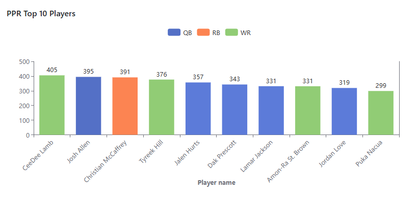
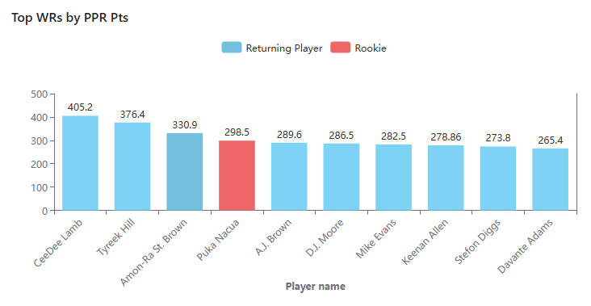
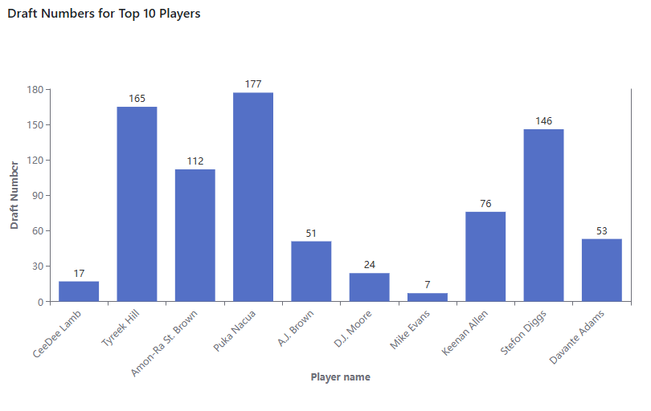
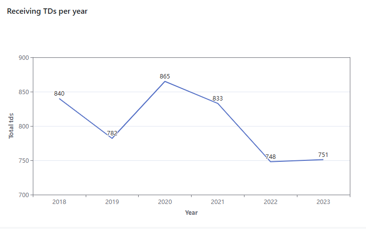
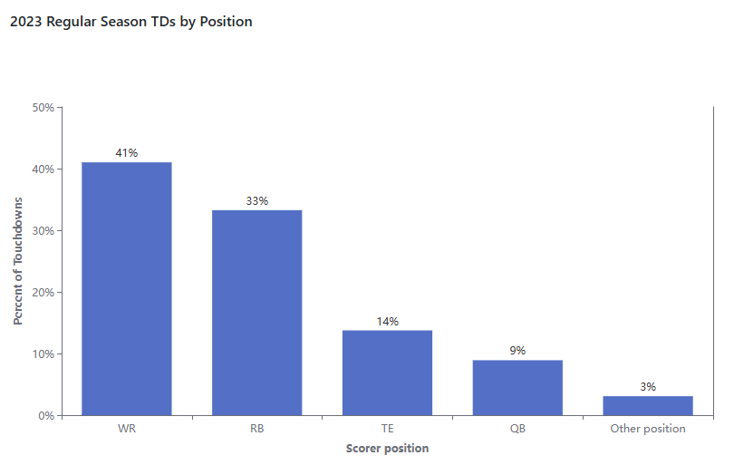
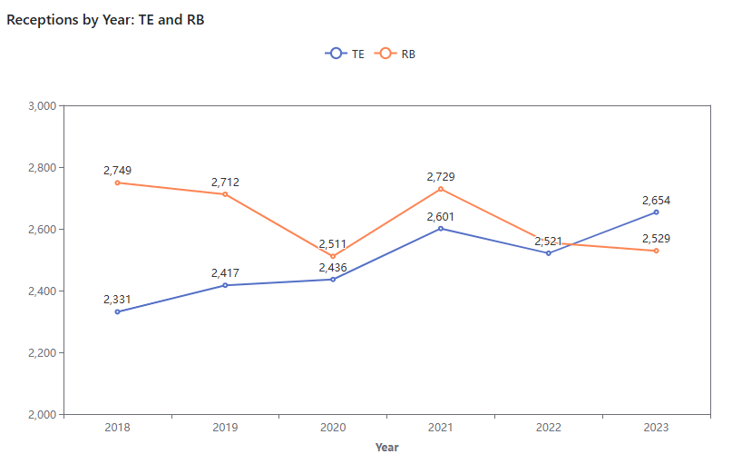
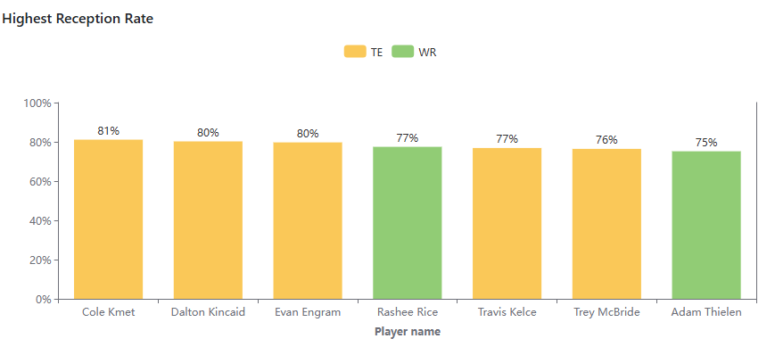

# dbt™ Data Modeling Challenge - Fantasy Football Edition

## Table of Contents
1. [Introduction](#introduction)
2. [Data Sources](#data-sources)
3. [Methodology](#methodology)
4. [Visualizations](#visualizations)
5. [Insights](#insights)
6. [Conclusions](#conclusions)

## Introduction

The objective of this challenge was to analyze and transform raw fantasy football NFL data to derive insights. I approached this challenge from the perspective of a fan looking to draft an NFL fantasy team. The ultimate goal being to maximize the chances of winning their fantasy league. 

[Include link to Lightdash dashboard] [TO DO]

## Data Sources
- [Fantasy Football Data (Snowflake)] - Tables preloaded by Paradime
- Snap Counts - Snap counts for the 2023 season by player and week pulled from [nfl_py_data](https://github.com/nflverse/nfl_data_py) via Python script
- Seasonal data: Regular season stats for each player by year (2018-2023) pulled from [nfl_py_data](https://github.com/nflverse/nfl_data_py) via Python script

## Methodology
### Tools Used
- Paradime for dbt™ modeling and SQL
- Snowflake for data warehousing
- Lightdash for visualization

### Applied Techniques

I created several staging, intermediate, and fact models based on the data sources. I also utilized some of the preloaded models. The following models were leveraged in my final submission:

Seed Files (sourced pulled from `nfl_py_data` via Python script)
* `seed_nfl_player_stats_yearly`
* `seed_nfl_snap_counts_2023`

Staging Layer
* `stg_player_snap_counts`
* `stg_yearly_player_stats`

Intermediate Layer
* `int_player_receiving_stats` - Intermediate model combining yearly regular season receiving stats and 2023 snap counts
* `int_touchdown_plays` - Intermediate model of all rushing and passing touchdowns in the 2023 season
* `int_fantasy_points_leaders` - Preloaded intermediate model of player fantasy points for 2023 season. I identified an issue in the grain of this model. It was shown by week, but I believe it was intended to represent yearly aggregations. I updated this model and `fct_fantasy_points_leaders` accordingly.

Mart Layer
* `fct_player_receiving_stats_yearly` - Model for receiving player stats and fantasy points for 2018-2023 regular seasons
* `agg_touchdown_plays` - Model for aggregated counts of 2023 rushing and pashing touchdowns by team, position, and game type. I adjusted the preloaded upstream  `stg_play_by_play` model, as I discovered `play_id` is not a unique identifier across games."
* `fct_fantasy_points_leaders` - Preloaded model of player fantasy points for 2023 season

## Visualizations
Here is my [Lightdash dashboard](https://app.lightdash.cloud/projects/ccbaf62f-52f2-4af9-9675-bbacf0556f82/dashboards/d6a57740-b426-47e7-a26d-911429577666/edit) containing the visualizations highlighted below.

## Insights

### Context: PPR Scoring

My first step was to educate myself about fantasy football scoring. Most fantasy leagues now use a PPR (Points Per Reception) format. You receive points for touchdowns and yards as with standard scoring. However, you also receive points for each reception with PPR scoring. 

For the 2023 season, 4 of the top 10 players in terms of PPR fantasy points were wide receivers.

While QBs often score a lot of points, it is typical to draft just 1 QB, but draft multiple receiving players (e.g., 2-3 WRs and 1 TE) in most leagues. With this knowledge in hand, I decided to focus on receiving players in my analysis.

### Top Players (Based on 2023 PPR Points)
I pulled a list of the the top 10 WRs or TEs in 2023 based on PPR points. There were no TEs in the top 10. 

It stood out to me that one player, Puka Nacua, was a rookie in 2023. After doing some research, I learned that Nacua:
* Was drafted with the 177th pick, meaning he has the highest draft number of the 10 players in this list.
* Broke the rookie records for both receiving yards and receptions [Source](https://www.espn.com/nfl/story/_/id/39261306/rams-puka-nacua-breaks-nfl-rookie-receiving-yards-record)

In general, for the top WRs, draft number was not a good predictor of their performance. 4 of the top 10 were drafted with the 112th or later pick.

## Snap Counts
For these top 10 players, I looked at offensive snap counts. Did all these players participate in about the same number of plays in order to score these points or were some more efficient than others?

Tyreek Hill was by far the most efficient point scorer. Every other player in the top 5 had over 1,000 snaps, but Hill played only 735 offensive snaps. He averaged 0.51 PPR points per snap played.

### Receiving Touchdowns
I also looked at receiving statistics over the past several seasons in order to get an idea of any trends over time. I analyzed data from the 2018-2023 regular seasons.

The number of receiving touchdowns has been declining since 2020 and dropped precipitously in 2022. 

Despite this decline, WRs and TEs still accounted for 55% of regular season touchdowns in 2023 (41% and 14%, respectively.)

### Tight ends

Overall, receptions by tight ends are trending up since 2018. In 2023, tight ends caught more receptions than running backs. (This isn't just due to the "Travis Kelce effect." The trend holds true even if you remove Kelce from the analysis.)

When looking at reception rates for WR/TEs with at least 80 targets, there are 7 players with a 75% rate or higher in 2023. 5 of them are TEs.

## Conclusions
[Summarize key takeaways and recommendations]
[TO DO]
