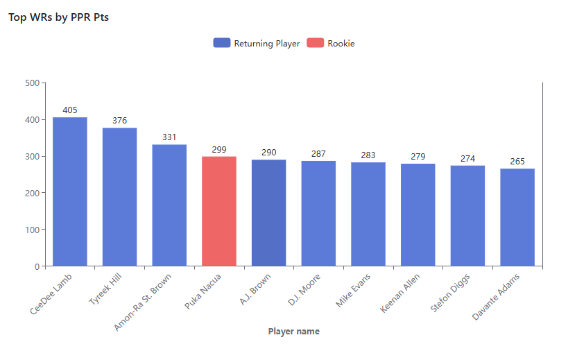
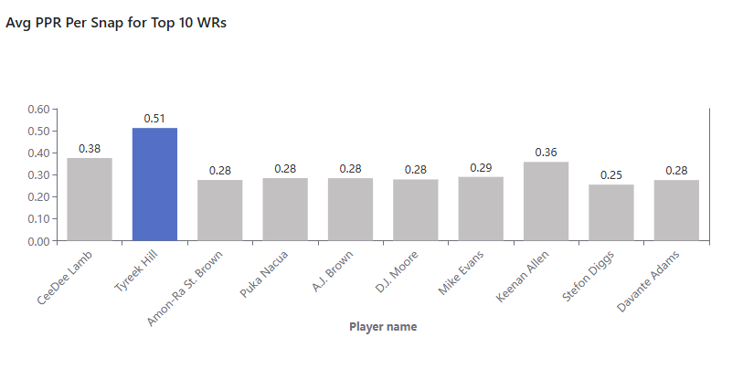
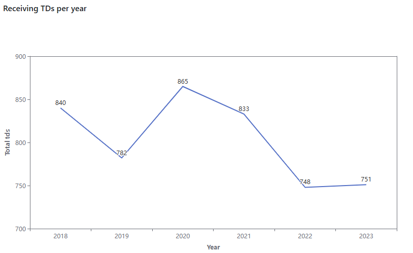
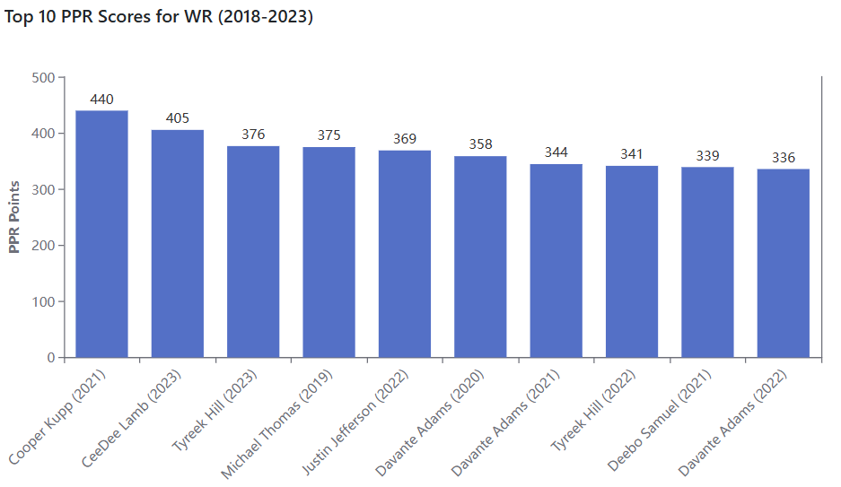

This repository contains Katie Shaffer's entry in the 2025 dbt™ Data Modeling Challenge - Fantasy Football Edition.

# dbt™ Data Modeling Challenge - Fantasy Football Edition

## Table of Contents
1. [Introduction](#introduction)
2. [Data Sources](#data-sources)
3. [Methodology](#methodology)
4. [Visualizations](#visualizations)
5. [Insights](#insights)
6. [Conclusions](#conclusions)

## Introduction

The objective of this challenge was to analyze and transform raw fantasy football NFL data to derive insights. I approached this challenge from the perspective of a fan looking to draft an NFL fantasy team. The ultimate goal being to maximize the chances of winning their fantasy league. 

[Include link to Lightdash dashboard] [TO DO]

## Data Sources
- [Fantasy Football Data (Snowflake)] - Tables preloaded by Paradime
- Snap Counts - Snap counts for the 2023 season by player and week pulled from [nfl_py_data](https://github.com/nflverse/nfl_data_py) via Python script
- Seasonal data: Regular season stats for each player by year (2018-2023) pulled from [nfl_py_data](https://github.com/nflverse/nfl_data_py) via Python script

## Methodology
### Tools Used
- Paradime for dbt™ modeling and SQL
- Snowflake for data warehousing
- Lightdash for visualization

### Applied Techniques

I created several staging, intermediate, and fact models based on the data sources. I also utilized some of the preloaded models. The following models were leveraged in my final submission:

Seed Files (sourced pulled from `nfl_py_data` via Python script)
* `seed_nfl_player_stats_yearly`
* `seed_nfl_snap_counts_2023`

Staging Layer
* `stg_player_snap_counts`
* `stg_yearly_player_stats`

Intermediate Layer
* `int_player_receiving_stats` - Intermediate model combining yearly regular season receiving stats and 2023 snap counts
* `int_touchdown_plays` - Intermediate model of all rushing and passing touchdowns in the 2023 season
* `int_fantasy_points_leaders` - Preloaded intermediate model of player fantasy points for 2023 season. I identified an issue in the grain of this model. It was shown by week, but I believe it was intended to represent yearly aggregations. I updated this model and `fct_fantasy_points_leaders` accordingly.

Mart Layer
* `fct_player_receiving_stats_yearly` - Model for receiving player stats and fantasy points for 2018-2023 regular seasons
* `agg_touchdown_plays` - Model for aggregated counts of 2023 rushing and pashing touchdowns by team, position, and game type. I adjusted the preloaded upstream  `stg_play_by_play` model, as I discovered `play_id` is not a unique identifier across games."
* `fct_fantasy_points_leaders` - Preloaded model of player fantasy points for 2023 season

## Visualizations
Here is my [Lightdash dashboard](https://app.lightdash.cloud/projects/ccbaf62f-52f2-4af9-9675-bbacf0556f82/dashboards/d6a57740-b426-47e7-a26d-911429577666/edit) containing the visualizations highlighted below.

## Insights

### Context: PPR Scoring

My first step was to educate myself about fantasy football scoring. Most fantasy leagues now use a PPR (Points Per Reception) format. You receive points for touchdowns and yards as with standard scoring. However, you also receive points for each reception with PPR scoring. 

For the 2023 season, 4 of the top 10 players in terms of PPR fantasy points were wide receivers.

While QBs often score a lot of points, it is typical to draft just 1 QB, but draft multiple receiving players (e.g., 2-3 WRs and 1 TE) in most leagues. With this knowledge in hand, I decided to focus on receiving players in my analysis.

### Top Players (Based on 2023 PPR Points)
I pulled a list of the the top 10 WRs or TEs in 2023 based on PPR points. There were no TEs in the top 10. 

It stood out to me that one player, Puka Nacua, was a rookie in 2023. After doing some research, I learned that Nacua:
* Was drafted with the 177th pick, meaning he has the highest draft number of the 10 players in this list.
* Broke the rookie records for both receiving yards and receptions ([Source](https://www.espn.com/nfl/story/_/id/39261306/rams-puka-nacua-breaks-nfl-rookie-receiving-yards-record))

In general, for the top WRs, draft number was not a good predictor of performance. 4 of the top 10 were drafted with the 112th pick or later.

## Snap Counts
For these top 10 players, I looked at offensive snap counts. Did all these players participate in about the same number of plays in order to score these points or were some more efficient than others?

Tyreek Hill was by far the most efficient point scorer. Every other player in the top 5 had over 1,000 snaps, but Hill played only 735 offensive snaps. He averaged a very impressive 0.51 PPR points per snap played! 

Also of note, Keenan Allen, played only 13 regular season games. All other players in this list played at least 16 games. CeeDee Lamb had the second highest snap count in the list (1,075) and still maintained a ridiculous PPR per snap of 0.38.

### Receiving Touchdowns
I looked at receiving statistics over the past several seasons (2018-2023) in order to get an idea of any trends over time. 

The number of receiving touchdowns has been declining since 2020 and dropped precipitously in 2022. 

Despite this decline, WRs and TEs still accounted for 55% of regular season touchdowns in 2023 (41% and 14%, respectively.)

Given the decline in receiving TDs, I wanted to see how 2023's top PPR scores stacked up to prior seasons (starting in 2018). Here are the top 10 PPR scores by a wide receiver in the last 5 seasons.

CeeDee Lamb and Tyreek Hill's 2023 were only outdone by Cooper Kupp's 2021 season. Also, Tyreek Hill's 2022 season also made the top 10. Devante Adams is Mr. Consistent, scoring at least 336 points for 3 straight seasons. It is also worth highlighting that each of the past 5 seasons has had a different WR as number 1 in PPR.

### Tight ends

Overall, receptions by tight ends are trending up since 2018. In 2023, tight ends caught more receptions than running backs. (This isn't just due to the "Travis Kelce effect." The trend holds true even if you remove Kelce from the analysis.)

When looking at reception rates for WR/TEs with at least 80 targets, there are 7 players with a 75% rate or higher in 2023. 5 of them are TEs.

## Conclusions
Make sure you have a good understanding of the scoring system for your specific fantasy league before drafting any players. If you are in a league with PPR scoring, drafting top receiving players will be crucial to your success. Wide receivers will typically deliver the most points, as they have more targets, receptions, and touchdowns than other positions (despite an overall decline in passing TDs over the years).

A player who is on the field more has more chances to score points. Though, some players like Tyreek Hill and Keenan Allen are highly efficient and scored in the top 10, even with fewer snaps than their counterparts. CeeDee Lamb was incredibly consistent, combining a high snap count and scoring efficiency to be the top player in the league at any position. However, each of the past 5 seasons has seen a different top scoring WR, so it will be tough for Lamb to retain his top spot in 2024. (Spoiler alert: He was indeed dethroned, finishing 5th among WRs in 2024.)

Don't be tempted by the top draft picks. These players will likely be more expensive and draft number is not always a good indicator of performance (at least it wasn't for wide receivers in 2023). 

While wide receivers get a lot of attention, don't sleep on tight ends. The number of receptions by tight ends has been trending upwards over the last several seasons. In 2023, they surpassed running backs for number of receptions. In terms of reception rates, many of the top players were tight ends.

Tight ends are typically much cheaper than wide receivers to draft. Also, some leagues are "Tight End Premium," meaning that tight ends get more points per reception. For example, WR and RBs may get 1 point per reception, while TEs get 1.5 points. Drafting a reliable, sure-handed tight end could be the advantage that wins you the league.
