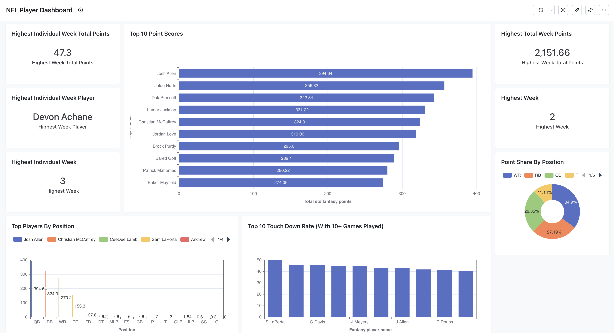
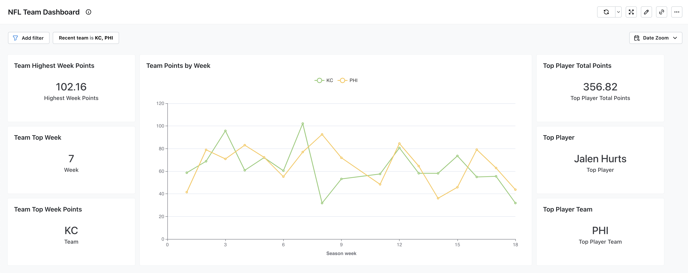
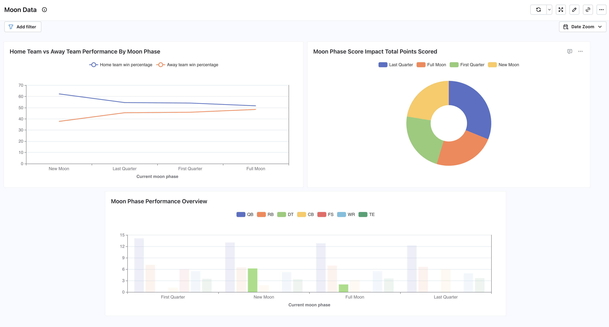

# Fantasy Football Data Modeling Challenge Submission

## Introduction
The primary goal of this challenge wasn’t just about analysing fantasy football data—it was about gaining hands-on experience with tools I hadn’t used before and exploring what could be achieved with them. Diving into an unfamiliar dataset with minimal external knowledge was both exciting and insightful, and the combination of Lightdash and Paradime made it incredibly easy to get up and running and iterate quickly.

I wanted to think slightly out of the box and have "some fun" which is why I went down the route of getting moon phases and seeing how that would impact NFL game (my intuition was that it doesn't but you never know if you don't ask the question)

Beyond the analysis itself, this challenge has been an excellent learning experience. It’s helped me identify areas for growth in data modelling and dbt, which I don’t often get to explore in my day-to-day work. More than anything, it’s reinforced the importance of curiosity and experimentation in data projects and the benefit of getting outside of your comfort zone.

## Lightdash Dashboard Links
[\[Team Dashboard\]](https://app.lightdash.cloud/projects/ebd2e0b6-47a3-451f-9370-3e6d2886e75f/dashboards/15e8eda1-2b61-466b-9f66-badf63baac27/view?filters=%7B%22dimensions%22%3A%5B%7B%22id%22%3A%229b400bed-2a3a-47a5-a31c-ff78c8a0ef94%22%2C%22target%22%3A%7B%22fieldId%22%3A%22fct_weekly_top_performers_recent_team%22%2C%22fieldName%22%3A%22recent_team%22%2C%22tableName%22%3A%22fct_weekly_top_performers%22%7D%2C%22values%22%3A%5B%22KC%22%2C%22PHI%22%2C%22ARI%22%2C%22ATL%22%2C%22BAL%22%2C%22BUF%22%2C%22CAR%22%2C%22CHI%22%2C%22CIN%22%2C%22CLE%22%2C%22DEN%22%2C%22DAL%22%2C%22DET%22%2C%22GB%22%2C%22HOU%22%2C%22IND%22%2C%22JAX%22%2C%22LA%22%2C%22LAC%22%2C%22LV%22%2C%22MIA%22%2C%22MIN%22%2C%22NO%22%2C%22NE%22%2C%22NYG%22%2C%22NYJ%22%2C%22PIT%22%2C%22SF%22%2C%22TB%22%2C%22TEN%22%2C%22WAS%22%2C%22SEA%22%5D%2C%22disabled%22%3Afalse%2C%22operator%22%3A%22equals%22%7D%5D%2C%22metrics%22%3A%5B%5D%2C%22tableCalculations%22%3A%5B%5D%7D)
[\[Player Dashboard\]](https://app.lightdash.cloud/projects/ebd2e0b6-47a3-451f-9370-3e6d2886e75f/dashboards/e4327d7f-be93-4fcb-98c3-ecde42063298/view)
[\[Moon Dashboard\]](https://app.lightdash.cloud/projects/ebd2e0b6-47a3-451f-9370-3e6d2886e75f/dashboards/693ed9b4-dd21-4831-9c3a-a66fe5ed278c/view)

## Data Sources
- **Primary Fantasy Football Data (Snowflake)**:
  - `play_by_play`: Detailed play-level data from NFL games
  - `player_stats_by_game`: Player performance statistics per game
  - `nfl_teams`: Team name and abbreviation mappings, sourced from wikipedia.
  - `nfl_fixtures`: Game schedules and results, sourced from wikipedia.
- **Environmental Data**:
  - `moon_phases`: Lunar calendar data for 2023-2024 season generated using ephem python package.
  
## Methodology

### Tools Used
- **Paradime**: Primary development environment for dbt™ models and SQL transformations
- **Snowflake**: Data warehouse hosting raw and transformed data
- **Lightdash**: Data visualization and dashboard creation
- **dbt**: Data transformation and modeling
- **Git**: Version control and project management
- **Claude 3.5 Sonnet**: AI assistants

### Applied Techniques
1. **Data Modeling**:
   - Created staging models to standardize raw data:
     - `stg_play_by_play`: Cleaned and standardized play-level NFL data
     - `stg_player_stats_by_game`: Normalized player statistics
     - `stg_nfl_teams`: Team name and abbreviation mappings
     - `stg_moon_phases`: Lunar calendar standardization
     - `stg_nfl_fixtures`: Game schedule and results formatting

2. **Key Transformations**:
   - **Player Performance Analysis**:
     - Fantasy point calculations with PPR adjustments
     - Position-based performance rankings
     - Weekly top performer identification
     - Red zone efficiency metrics
   
   - **Game Analysis**:
     - Enhanced game outcomes with moon phase correlation
     - Score differential and close game calculations
     - Home/away performance metrics
     - Red zone conversion rates by team
   
   - **Environmental Impact Analysis**:
     - Moon phase integration with game statistics
     - Performance tracking across different moon phases
     - Timestamp-based moon phase matching

3. **Advanced Metrics Implementation**:
   - Expected Points Added (EPA) calculations
   - Position-specific efficiency metrics:
     - Completion percentage in red zone
     - Touchdown conversion rates

4. **Testing Strategy**:
   - Schema tests for data integrity:
     - Unique constraints on team abbreviations
     - Not null constraints on critical fields
   - Data quality monitoring:
     - Completeness checks
     - Consistency validation

## Visualizations

### 1. Player Performance Dashboard  
- **Top 10 Point Scorers**: Josh Allen leads with **394.64 points**, followed by Jalen Hurts and Dak Prescott.  
- **Highest Individual Week**: Devon Achane scored **47.3 points** in Week 3.  
- **Point Share by Position**: **WRs (34.9%)** have the largest fantasy point share, followed by **RBs (27.19%)**.  
- **Top TD Rates**: Sam LaPorta and Gabe Davis lead in **TD conversion rates** (10+ games played).  

### 2. Team Performance Dashboard  
- **Weekly Points Trend**: Tracks **KC and PHI** fantasy points across the season.  
- **Highest Team Week**: **KC scored 102.16 points in Week 7**.  
- **Top Player Contribution**: **Jalen Hurts (PHI)** led with **356.82 total points** out of the two teams.  

### 3. Moon Dashboard  
- **Home vs. Away Performance**: No clear impact of moon phases on win percentages.  
- **Moon Phase Score Impact**: Fantasy points distributed across moon phases with no significant trend.  
- **Position Performance**: No strong correlation between player performance and moon phases.  

### Summary  
**Player and team dashboards** provided key insights, while the **moon analysis confirmed no meaningful impact on NFL games**—but it was fun to explore!

## Insights

### 1. For fantasy football managers pick QB first due to scarcity of QBs.
### 2. The moon probably has no impact on the result of football games.
### 3. WR have the largest share of points by position.
### 4. MIA had an insane week 3.

## Conclusions

### Key Takeaways
1. Main takeaway was it was great fun jumping into data and tools I have no experience with. I learned a lot and had a great time.
2. Again I cant emphasises this enough but the moon probably has no impact on the result of football games. (larger sample size would be needed to confirm this lol)
3. `Lightdash generate` is a very handy command the fact it doesn't overwrite the yaml file is great.

### Recommendations
1. **For Future Analysis**:
   - Utilise the Red Zone data more. (I didn't spend enough time understanding this data and how to use it.)
   - Add Game location data and weather data. Plot player performance by weather conditions.
   - Tighten up testing and data quality checks. Currently broad strokes for testing.
   - Add NFL Team Mapping abbreviation to team name to final fact tables.

---
*Submitted by: James Smith*

*Date: 2025-02-02*

*GitHub Branch: [\[Branch Link\]](https://github.com/paradime-io/nfl_data_modeling_challenge/tree/james-smith)*